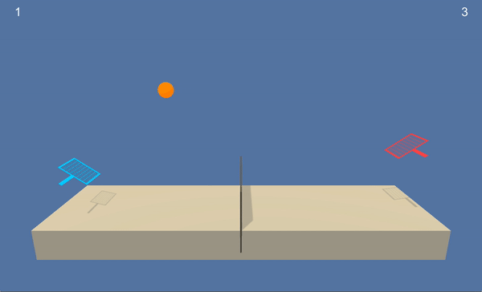

# Unity Tennis environment 

### Introduction

This repository contains an implementation of PPO that solves the Unity Tennis environment. The implementation is based on the existing implementations by [Shangtong Zhang](http://shangtongzhang.github.io/) and [Herimiaina Andria-Ntoanina](https://github.com/kotogasy). Mr. Zhang in particular has a DRL repository with modular implementations of several algorithms, be sure to check it out.



The set-up is as follows: the two tennis paddles are trained to bounce the ball back and forth. A paddle receives a reward of +0.1 for bouncing the ball over the net, and a reward of -0.01 for making it fall. At each timestep, each paddle receives its own 8-dimensional observation vector, encoding information about the position and velocity of the ball and paddle. The action space is comprised of two continuous variables: moving towards or away from the net, and jumping.

### Solving the Environment
It is clear that each paddle maximises its rewards by cooperating with its adversary. Optimal policy is identical for each paddle. Hence, due to the symmetry of the observation vectors, they may be combined to train a single PPO algorithm that dictates and trains the policy for both paddles. 

To solve the environment, the paddles must  average score of +0.5 over 100 consecutive episodes, where the score for each episode is taken to be the maximum score obtained by a paddle in that episode.

### Solution

We use the [Proximal Policy Optimization](https://arxiv.org/abs/1707.06347) (PPO) deep reinforcement learning algorithm to solve the environment.

### Try it yourself!

0. Install anaconda from [here](https://www.anaconda.com/distribution/).

1. Install unity ml-agents using the [instructions](https://github.com/Unity-Technologies/ml-agents/blob/master/docs/Installation.md) here.

2. Download the Tennis environment from one of the links below.  You need only select the environment that matches your operating system:

- [Linux](https://s3-us-west-1.amazonaws.com/udacity-drlnd/P3/Tennis/Tennis_Linux.zip)

- [Mac OSX](https://s3-us-west-1.amazonaws.com/udacity-drlnd/P3/Tennis/Tennis.app.zip)

- [Windows (32-bit)](https://s3-us-west-1.amazonaws.com/udacity-drlnd/P3/Tennis/Tennis_Windows_x86.zip)

- [Windows (64-bit)](https://s3-us-west-1.amazonaws.com/udacity-drlnd/P3/Tennis/Tennis_Windows_x86_64.zip)

3. Download the Tennis_PPO.ipynb notebook from this repository to train the agent. Follow these simple [these instructions](https://stackoverflow.com/questions/45622602/how-to-save-jupyter-notebooks-from-github).

4. Go to the relevant terminal and create a conda environment:
```
conda create -n myenv python=3.6
```

5. Activate the environment and open jupyter notebooks:
```
conda activate myenv
jupyter notebook
```

Then open up the Tennis_PPO notebook and run it.

If you're not on a Mac make sure to change the filename of the environment in the notebook.
