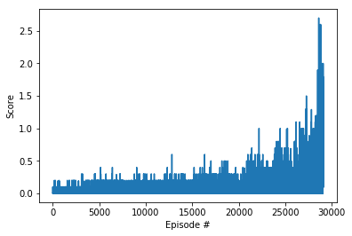

# Algorithm overview
The algorithm used is Proximal Policy Optimization, and the original paper can be found [here](https://arxiv.org/abs/1707.06347). [This](https://www.youtube.com/watch?v=5P7I-xPq8u8) explanation is a very good place to start to understand PPO; the algorithm is really quite sophisticated in terms of the mathematical techniques involved. 

In brief, the main features of the algorithm are:

1. As OpenAI states, PPO was devised as an attempt to answer the question ['how can we take the biggest possible improvement step on a policy using the data we currently have, without stepping so far that we accidentally cause performance collapse?'](https://spinningup.openai.com/en/latest/algorithms/ppo.html)  
2. It is an On-Policy RL algorithm, meaning it has no replay buffer where it saves (s,a,r,s) tuples to learn on multiple times. The algorithm establishes a policy for the episode, then trains after every episode on the tuples from that episode.
3. It can be implemented in Actor-Critic style, and indeed this implementation has both an Actor and a Critic NN. 

## Parameters
### Hyperparameters
| Parameter | Value|
| --- | --- |
| LR | 1e-4 |
| WEIGHT_DECAY | 1e-4 | 
| grad_clip| 5| 
| EPOCHS| 7| 
| BATCH_SIZE| 300| 
| GAMMA | 0.999 |           
| GAE_TAU | 0.9 |             
| CLIP_EPSILON | 0.1 |        
| C1 | 0.4 | 
| C2 | 0.01| 

### Actor network architecture:
| Layer | Size |
| --- | --- |
| input | 8 |
| hidden_1 | 30 |
| ReLU | - |
| hidden_2 | 30 |
| ReLU | - |
| output | 2 |

### Critic network architecture:
| Layer | Size |
| --- | --- |
| input | 20 |
| hidden_1 | 380 |
| ReLU | - |
| concat with actor output | - |
| hidden_2 | 280 |
| ReLU | - |
| output | 1 |

## Solution
We solved the environment in 28995 episodes.

   

## Improvements ideas

Implementing TRPPO which just came out this year, a blend of TRPO and PPO, and playing around with the hyperparameters.
